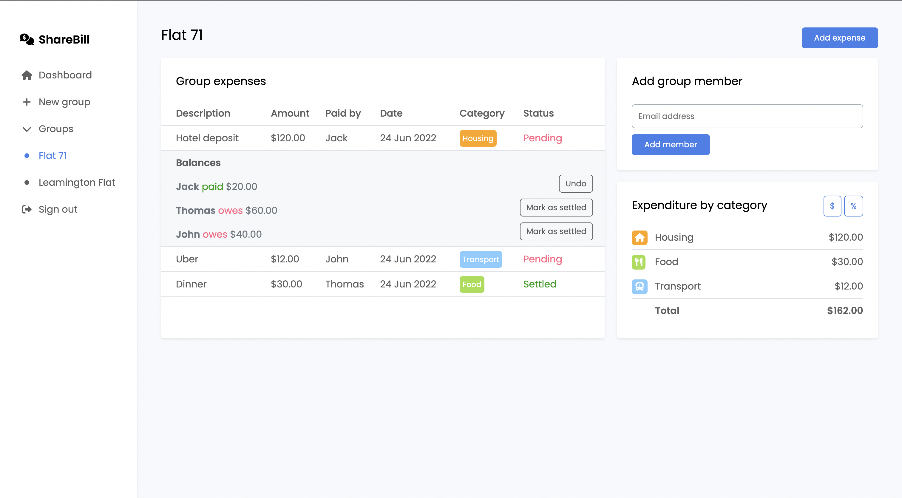

# ShareBill

Flask web application for managing shared expenses, built with Python, SQL, JavaScript, HTML and CSS.
**Demo:** https://youtu.be/OcrQcPPztnA

___

## Main features

### Account registration

- User registers for an account by entering their first name, last name, email address, password and confirming their password.
- Form data posted to `/register`, which ensures that all input fields were filled in, a user with that email address does not already exist and the password matches the confirmation.
- Displays error message and prompts user to re-enter credentials if their input does not meet the above conditions.
- Otherwise user's credentials are stored in the database and they are redirected to login page (`/login`).

### User authentication/login

- User logs in by entering their email address and password.
- Form data posted to `/login`, which ensures that a user with that email address exists and that the password entered matches that user's.
- Displays error message and prompts user to re-enter credentials if their input does not meet the above conditions.
- Otherwise user is logged in and redirected to their dashboard (`/`).

### Create group

- User can create a new group by clicking on 'New group' in the sidebar and entering a name for the new group.
- Form data posted to `/create_group`, displays an error message using **jQuery** if a group name was not entered, **without reloading** the page.
- Otherwise creates a new group with the given name, reloads page to update sidebar.

### Add group members

- User can add other users to one of their existing groups from the page corresponding to that group (`/group-[group id]`) by entering their email address.
- Email address is posted to `/add_member` using **AJAX** and validated to check if a user with that email has an account and is not already a member of the current group.
- Displays error message if their input fails the above conditions using **jQuery**.
- Otherwise adds user with corresponding email address to current group, inserting their details to the form to add a new expense **without reloading** the page.

### Adding expenses

- Shared expenses can be added from the group page (`/group-[group id]`) by clicking on the 'Add expense' button and selecting the payer, entering a description, amount spent, method of splitting the expense, category and date.
- Default option is to "Split equally between all members". This option can be altered, as detailed in the section on additional features below.
- Form data posted to `/add_expense` using **jQuery**, which ensures that every field was entered correctly, displaying an error error message **without reloading** the page if not.
- Otherwise adds expense and individual debts for each user required to pay a portion of the expense to the database, reloading the page to update the data displayed.

### Deleting expenses

- Expenses can be deleted by clicking the 'x' icon at the end of every row in the 'Group expenses' table on the group page (`/group-[group id]`).
- Deleting an expense causes all the associated debts to be deleted as well.

### Settling debts/expenses

- Debts for individual expenses can be viewed by clicking on the corresponding row in the 'Group expenses' table, which expands to reveal the status of that expense (i.e. group balances, amounts paid/owed).
- Debt belonging to original payer of expense **automatically marked as paid** by default.
- Debts settled by clicking 'Mark as settled' button in accordion panel.
- Previous debt settlements can also be **reverted by clicking 'Undo'** button.
- Expense is marked as 'Settled' only once all members' debts have been marked as settled. Otherwise, the expense is marked as 'Pending'.
- Settling/reverting of debts handled by `/settle_debt`, **jQuery** used to change text and styling for debt status ('owes' or 'paid'), expense status ('Pending' or 'Settled'), button and success alert.

### Notifications for new expenses

- User is notified of a new expense on their dashboard (`/`) via a **flashed message** and **'New' indicator** under 'Pending debts'.
- Expenses listed under 'Pending debts' only refer to expenses that the current user is required to pay for and has not already done so, as opposed to expenses shared by other group members.
- New expenses are marked as 'seen' upon being displayed on the dashboard, so that they are not rendered as 'new' expenses again.

___

## Additional features

### Dashboard

- Dashboard (`/`) provides the current user with valuable information at a quick glance, namely:
    - Total balance (amount they are owed – amount they owe) - changes colour depending on sign
    - Total amount they owe
    - Total amount owed to them
    - Number of pending debts
- Debt details displayed in 'Pending debts', with button at the end of each row that can be clicked to go to that group to view details/settle debt.
- **Total expenditure by each group** that the user is a member of, in order of amount spent.

### Expense categorisation

- Every expense assigned a category by the user, chosen out of default options -  allows users and groups to **better analyse spending habits.**
- Displayed under 'Expenditure by category': each category that the group members have tagged expenses to (along with an **associated symbol and colour** that matches the styling in the 'Group expenses' table), ordered by amount spent (greatest expenditure rendered first).
- Total amount spent per category can be displayed as a **value in dollars or percentage** of the total amount spent by that group, by clicking the button at the top of the table.

### Splitting expenses between selected members

- Expenses can be split with a **subset of group members** by selecting the 'Split differently' option when adding a new expense.
- Bill can be split equally between selected members, or distributed proportionally (see next point).
- **jQuery used extensively** to hide/show table and input fields, toggle active styling for selected option, disable and empty input fields for users not selected to pay for expense.
- All members selected easily as payers with **'All' checkbox** - automatically unchecked when a single user is deselected.

### Splitting expenses proportionally

- Expenses can also be **split proportionally: by exact amounts or percentages** of the total amount spent.
- Calculations carried out to determine how much each member owes based on amount or percentage.
- Ensure that the **sum of amounts paid by each selected member tallies** with the total amount spent or 100%
- Error message displayed **without reloading using AJAX** if input is invalid.

### Multiple groups per user

- No limit on number of groups that a user can be a member of.
- Enables better management of shared expenses in general as opposed to a single group (e.g. group for household, holiday with friends, etc.).

### Responsive grid layout

- Making browser window narrower causes layout of page to change for better usability.
- **Sidebar** contracts to only display symbols instead of text lines as well.
- **Grid-layout** changes dimensions/ordering on smaller screens.

___

## Other considerations

### Security

- Protection from **SQL injection** attacks: pure SQL only executed twice, by using a **parameterised query** and on the second occasion list of group IDs obtained directly from database (cannot contain malicious content).
- Protection from **XSS**: characters automatically escaped by using **Jinja2 templates**. Text only appended using jQuery on one occasion - the user's first name, which has already been made safe using `escape()` from `markupsafe` when storing it.
- **`@login_required`** used throughout to prevent unauthorised access.
- If a user attempts to access the page for a group that they are not a member of, they are instantly **redirected** back to dashboard.

### Accessibility

- All input fields are paired with a **`<label>`** tag which is given the `visually-hidden` class to ensure that it does not impact the UI while maintaining support by assistive technologies such as **screen-readers**, as stated on https://www.w3.org/WAI/tutorials/forms/labels/.
- All font-awesome icons given the `aria-hidden='true'` attribute for accessibility purposes. Icons with a semantic meaning (e.g. close modal) accompanied by `visually-hidden` span describing purpose of icon, as recommended on https://fontawesome.com/docs/web/dig-deeper/accessibility.

### External frameworks (available offline)

- jQuery (`static/js/jquery-3.6.0.min`)
- Google Fonts: Poppins (`static/css/fonts.css`)
- Font Awesome Icons (`static/fontawesome-icons`)
